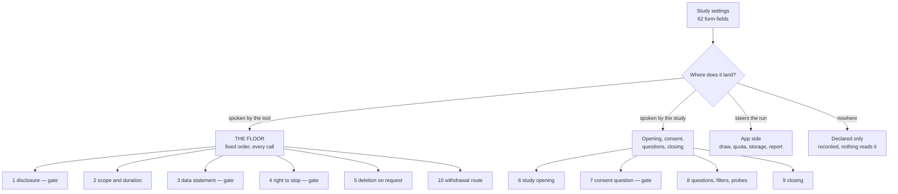

# PROMPT-MAP — every researcher option, and what it does to the call

A study is configured in 62 settings. Some become sentences the voice agent speaks,
some steer the run without ever reaching the call, and some do neither although they
promise to. This map says which is which, per option, so the question

> Does every researcher option meet its effect — in the prompt or in the app — and where
> does it not?

can be answered by reading rather than by guessing. The first live calls found two
answers the hard way: a required privacy notice that never reached the phone, and a
duration promised in one code path and silent in the other. Both are rows here now.

**Two columns, not one.** For every option the map states where it lands *and* whether
anything checks that it arrived. A sentence composed into the task can still be swallowed
by the agent — only gate phrases are compared against the transcript afterwards. Coverage
of the generation is not coverage of the behaviour.

**The map is claim; `tests/test_prompt_map.py` is measurement.** Flip tests assert that a
changed option changes the task in the documented way, negative tests assert that
app-side options change nothing in it, and four golden task texts under `tests/goldens/`
catch changes nobody intended. Regenerate them with `RESEARCHCALL_WRITE_GOLDENS=1` and
read the diff before accepting it.

## What the call is made of

Gate phrases are compared against the transcript after the call; a missing one opens a
review case. The others are composed but unverified — see the open gap at the end.

## The floor: what every call owes

| Sentence | Built from | In the prompt | Checked |
|---|---|---|---|
| AI disclosure | `ethics.commissioner` | always, first | **gate** `ai_disclosure` |
| Scope and duration | items + `ethics.time_estimate` (locked) | always | no |
| Data statement | `ethics.privacy_short` | always | **gate** `data_statement` |
| Right to stop | fixed wording | always | **gate** `stop_right` |
| Deletion on request | fixed wording | always | no |
| Withdrawal route | `ethics.withdrawal_contact` | always, last | no — a call that breaks off early never reaches it |

`commissioner`, `privacy_short` and `withdrawal_contact` are required: without them a live
run is refused and a dry run reports `disclosure_incomplete`.

## Station 3 — the conversation frame

| Option | Effect | In the prompt | Checked |
|---|---|---|---|
| `ethics.instruction` | script | opening block, verbatim | no |
| `ethics.greeting` | script | opening block, freely phrased | no |
| `ethics.number_origin` | script | opening block, verbatim | no |
| `ethics.privacy_text` | script | opening block (long notice), verbatim | no |
| `ethics.privacy_short` | script | floor, before consent | gate |
| `ethics.commissioner` | script | floor, in the disclosure | gate (as part of it) |
| `ethics.withdrawal_contact` | script | floor, at the end | no |
| `ethics.time_estimate` | frame, **locked** | floor, always | no |
| `ethics.consent_explicit` | frame | consent is always asked | gate (`consent_question`) |
| `ethics.right_to_stop` | frame | floor, always | gate (`stop_right`) |
| `ethics.on_refusal.ask_reason` | script | adds the refusal question + schema field | no |
| `ethics.on_refusal.offer_callback` | run | adds the callback question; re-queues who accepts | no |
| `ethics.closing` | script | closing block, freely phrased | no |
| `ethics.policies` | declared | — | — |
| `disclosure_level` | declared | — | — |

**Opening blocks exist only where the workbench built the study.** A questionnaire loaded
from a file carries none — which is why the first field trial spoke neither the
introduction nor the long privacy notice. The floor is the answer to that asymmetry: it is
composed by the tool and therefore path-independent.

## Station 2 — the instrument

| Option | Effect | In the prompt | Checked |
|---|---|---|---|
| `items` | script | every question, verbatim, with its categories | wording audit (consent + questions) |
| `questionnaire.jump_rules` | run | `FILTER: Ask only if …` per filtered item | no |
| `questionnaire.order` | run | order of the question blocks; scope promise unchanged | no |
| `questionnaire.parallel_forms` | declared | — | — |
| scale items | script | the scale announcement is part of the wording | wording audit |
| open items | script | asked freely, never categorised during the call | schema forbids a category |

## App side — steers the run, never the call

These are correct as they are; the map records them so nobody looks for them in the task.
`tests/test_prompt_map.py` asserts that flipping them leaves the task text byte-identical.

| Option | Where it takes effect |
|---|---|
| `sample.size`, `sample.method`, `sample.assign_windows_randomly`, `sample.time_windows` | drawing the sample |
| `contact_rules.attempts_per_person`, `…spread_attempts`, `…callback_after_refusal_max`, `…daily_quota` | who is dialled again, and when |
| `fieldwork.keep_transcript` | whether the transcript is stored with the attempt |
| `fieldwork.stop_on_error`, `fieldwork.resumable` | how a run reacts to failures |
| `analysis.unlisted_answers`, `analysis.free_comments` | coding after the call |
| `reporting.findings_file`, `pretest.*`, `publication.*` | pretest, report and publication |
| `RESEARCHCALL_FIELD_TRIAL_PHONE` (environment) | routes every dial to one briefed line |

## Declared only — recorded, nothing reads them

18 of 62 fields are `declared`: `fieldwork.storage`, `fieldwork.path`,
`fieldwork.poll_interval_seconds`, `contact_rules.calling_hours`,
`contact_rules.concurrent_calls`, `sample.source`, `ethics.policies`,
`disclosure_level`, `reporting.disclosure_level`, `reporting.languages`,
`reporting.journal_format`, `publication.target`, `questionnaire.parallel_forms`,
`analysis.qualitative.methods`, `analysis.qualitative.rating_models`,
`pretest.send_to_reviewers`, `pretest.call_reviewers`, `pretest.self_test_calls`.

Declared is a legitimate state — the interface says so next to every one of them — but it
is a promise to a researcher that the value is only recorded. `effect.py` is the single
place that decides it, and a field missing from that register fails the test suite.

## Gaps

A gap is not "an option that does nothing". It is a mismatch between what the tool
promises and what it does — including **options that do not exist although the behaviour
needs them**. That last kind is the hardest to see, because nothing in the configuration
points at it.

| Gap | Found by | State |
|---|---|---|
| Privacy notice never reached calls built from a file | live call D1, 2026-08-11 | **closed** — `ethics.privacy_short` in the floor |
| Duration promised only in the workbench path | live call D1, 2026-08-11 | **closed** — floor, and the switch was locked |
| The same promise spoken twice in two wordings | live call D1 | **closed** — the consent sentence is the question, the floor owns the ethics |
| No option for "the answer fits no category" | live call D1 | **closed** — two attempts, then raw answer without a category |
| Deletion happened but was never announced | live call D2 | **closed** — deletion-on-request sentence |
| **Floor sentences other than gates are never verified** | this map | **open** — the wording audit builds its expectations from consent and questions only, so a swallowed scope, deletion or withdrawal sentence goes unnoticed |
| **Voicemail and NO_ANSWER classification** | FINDINGS §9 | **open** — implemented and unit-tested, never measured live (D3 fell to an empty balance) |

The open row about unverified floor sentences is the reason this map has two columns
instead of one. It would have been invisible in a map that only asked "does the option
reach the prompt?".
