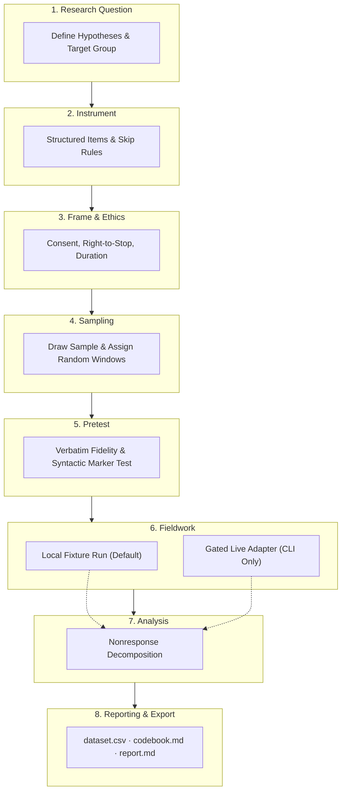

<div align="center">

[](https://github.com/ellmos-ai)
[](https://github.com/open-bricks)
[](https://www.python.org/)
[](SPEC.md)
[](pipeline/)
[](tests/)
[](llms.txt)

**English · [Deutsch](README_de.md)**

</div>

> [!TIP]
> **AI Agent & LLM Context**: This repository provides machine-readable architecture, station definitions, and discoverability metadata in [`llms.txt`](llms.txt).

## Demo video

[](https://youtu.be/YGRLpDwrTq4)


# ResearchCall

ResearchCall is a dry-run-first Python tool for standardized scientific telephone surveys. It builds the questionnaire from the answers given in its own stations, draws a random sample, assigns each selected record to a randomized time window at draw time, dials each person once by default, and reports nonresponse without collapsing distinct CALL-E outcomes.

The default path is fully local: no account, credentials, SDK, network connection, or real call is needed. Fixtures exercise the same sampling, attempt, response, withdrawal, and reporting logic used by the gated live adapter.

## One research method, three ways in

ResearchCall is a research procedure that happens to use calls, not a call script with a report attached. Its pipeline covers eight gated stations: research question, instrument, conversation and ethics frame, sampling, pretest, fieldwork, analysis, and reporting. The call transport is only one implementation step inside that method.



Every human decision has one form definition under `pipeline/_shared/forms/`. The same definition can be read in three ways:

- as a config value through `config_defaults()`;
- as a spoken question for an agent through `interview()`;
- as a UI-ready field descriptor through `form()`.

The station router at `pipeline/SKILL.md` gives agents the procedure in words, while each station's `config.template.yaml` gives the corresponding machine-readable configuration. `load_fields()` connects both to the form definitions. Defaults avoid unnecessary interview turns; required values without defaults become questions; and locked methodological or ethical requirements become neither questions nor visible controls.

This is more than an automated interviewer: the method fixes the research question before the instrument, the instrument before fieldwork, the sampling exposure before outcomes are known, and the analysis rules before results are interpreted. It preserves raw answers beside categories, distinguishes nonresponse mechanisms, and carries measured limitations into the report.

## The workbench

`researchcall-web` serves the same eight stations as a bilingual web interface (English and German, switchable in the header). It is a *surface* on the pipeline, not a second implementation: its station pages render `forms.form(...)`, its field phase drives `runner.run_day`, and its report is `reporting.build_report`.

```powershell
python -m pip install -e ".[web]"
researchcall-web                    # http://127.0.0.1:8000
```

The interface adds no setting of its own. Every control is rendered from a form definition, so what it shows is exactly what the definitions declare:

| Station | Controls shown | Part of the frame | An agent asks |
|---|---|---|---|
| 1 Research question | 2 | 0 | 2 |
| 2 Instrument | 4 | 0 | 1 |
| 3 Conversation and ethics frame | 10 | 2 | 5 |
| 4 Sampling | 11 | 0 | 2 |
| 5 Pretest | 6 | 2 | 1 |
| 6 Fieldwork | 6 | 1 | 0 |
| 7 Analysis | 4 | 4 | 0 |
| 8 Reporting | 5 | 2 | 0 |
| **Total** | **48** | **11** | **11** |

Of 59 decisions, an interface shows 48, an agent asks 11, and 11 are part of the frame. The eleven locked ones — explicit consent, the right to stop, keeping the raw answer beside its interpretation, reporting nonresponse by time window — appear in no form and in no interview question. They are not disabled controls; they are not controls. `/config` and `/config.json` state them so that nothing is hidden.

Gating is enforced rather than described: station N+1 opens once N is finished, a station will not close while a required answer is missing, and a value changed after its station closed is stored as an amendment and marked *added later* in the interface.

**The answers build the call.** Station 2 carries the items, one line each — `id | hypothesis | format | "wording" | options` — in the formats the method knows: dichotomous, scale, reversed scale, choice, open and creative. A scale says its poles out loud, because "1 to 5" without them is a request for interpretation. Quantitative items are quoted and therefore spoken word for word; open items are left unquoted and may be rephrased, with a bounded number of follow-up probes. Skip rules (`if q1 = no skip q4, q5`) become a filter on the item they skip. Station 3 supplies the conversation frame — greeting, instruction, where the number came from, a duration *computed from the instrument*, the privacy text — and the consent sentence carries the right to stop, because a setting nobody can switch off has to be said rather than merely stored. `/instrument` shows the result as it will be spoken, `/instrument.task.txt` the exact text an agent would receive, and the field phase refuses to start while a line cannot be read.

With `questionnaire.order: randomised`, the item order is drawn **per respondent** — seeded by the record, so a rerun is reproducible — and filters survive the shuffle. A single shuffle per study would only remove the researcher's habit; position effects need a fresh order per call.

**A control that changes nothing says so.** Every setting is classified in `src/researchcall/effect.py` by where it takes effect — the call, the run, the analysis, the frame — or as *recorded only*, with the reason. The badge sits on the control itself, and `/config` lists the recorded-only ones together. A form definition that is not classified fails the test suite, so a new setting cannot arrive unlabelled and a setting cannot quietly change groups. Of 59 decisions, 40 act somewhere and 19 are currently recorded without effect. Writing the register was itself the check: three settings it first called effective turned out not to be, and were either connected or moved to the honest column.

**The data leaves.** `/export/dataset.csv` is one row per person and one column per item, `codebook.md` explains every column, and `free-text.csv` holds the free answers when `analysis.free_comments` keeps them apart. Reversed items are carried twice, as given and recoded — forgetting to turn them back measures the opposite of the scale.

**The instrument is tested before the people are.** `/pretest` runs the interview against the fixture transport N times and measures how faithfully it was delivered: verbatim wording item by item, the consent sentence, whether filters were respected, and a deliberately clumsy *syntactic marker* that a language model would want to repair. It also names what a dry run cannot decide — unplanned follow-ups and the order the agent really spoke in need a live transcript — and says plainly that it measures the local harness, not the CALL-E agent.

**The workbench cannot place a call.** No route accepts a live flag and the package never imports the live client; `FixtureCallClient` is the only transport it can reach. The field phase draws a sample of fictitious numbers, processes it one record at a time against fixtures, and streams progress over server-sent events. Placing a real call remains a command-line action behind the five-part gate below. The workbench reads and writes one local workspace directory (`RESEARCHCALL_WORKSPACE`, default `out/workbench`); it opens no network connection of its own, loads no external asset — HTMX is vendored under `src/researchcall/web/static/` — and prints no phone number on any page.

### Two languages, two places

Field text lives in the form definition itself: `label`/`question`/`help` carry German, `label_en`/`question_en`/`help_en` the English, and any further language is a `<key>_<lang>` entry away. A translation table in code would create a second source of truth for a field and would never reach the question an agent asks. Interface chrome — buttons, headings, messages — is what lives in a table, at `src/researchcall/web/locales/ui.json`. `python manage_translations.py --check --fields` verifies both and exits non-zero when either is incomplete.

## Methodological contract

- Questions use fixed wording and fixed answer categories.
- Conditional questions are the only preplanned follow-ups. The task explicitly forbids spontaneous probes and paraphrasing.
- Every interpreted category keeps the participant's raw answer beside it. A category without non-empty raw source text is rejected.
- Time windows are randomized when the sample is drawn, not chosen after an outcome is known.
- **One call per person by default.** `contact_rules.attempts_per_person` raises that bound, and only an availability outcome — `NO_ANSWER`, `BUSY`, `VOICEMAIL` — reopens a record. A refusal never does; only an explicit invitation to call later does, up to `contact_rules.callback_after_refusal_max`. A repeat is sent into a different time window, because dialling the same time of day again measures the same availability twice. The report states how many records were affected, so the shift towards people who are reachable more often is visible instead of folded into the completion rate.
- `run-day` processes at most the next `N` open records in one assigned time window. Recurrence belongs to the host scheduler; ResearchCall has no daemon or multi-day loop.
- Every claimed attempt receives `started_at` before the transport is invoked and `ended_at` on terminal, failed, or interrupted completion.
- `NO_ANSWER`, `DECLINED`, `BUSY`, `VOICEMAIL`, `FAILED`, `CANCELED`/`CANCELLED`, `EXPIRED`, and local `INTERRUPTED` remain distinct.
- Reports show completion yield, outcome structure by randomized time window, answer distributions by time window, and wording-fidelity evidence.

The report is descriptive. It does not turn differences between windows into claims of statistical significance.

## Setup

Requires Python 3.11 or newer. The command line has no runtime dependencies beyond the Python standard library, so the dry run works with nothing installed. The optional `web` extra adds FastAPI and Uvicorn for the workbench and is the only part that needs them.

```powershell
python -m venv .venv
.\.venv\Scripts\Activate.ps1
python -m pip install -e .
python -m unittest discover -s tests -v
python -m researchcall --help
```

The editable install is required when invoking `python -m researchcall` from the repository root. Running directly from an uninstalled `src` layout otherwise requires an explicit `PYTHONPATH=src`, which is not the documented workflow.

## 30-second jury dry-run — no access required

From the repository root, PowerShell can run the complete demonstration directly from the `src` tree, without installation, an account, credentials, network access, or a real call:

```powershell
$env:PYTHONPATH = "src"
python -m researchcall demo --workspace out/jury-demo --seed 42
```

Use an unused workspace name for a repeated run; the demo refuses to overwrite earlier evidence. The command prints `mode=dry-run transport=fixture network=disabled`, the imported/drawn/attempted counts, distinct terminal statuses, and the generated report path.

This command creates 200 fictitious frame rows, draws 50, randomly assigns their time windows, processes all 50 against mixed terminal fixtures, and writes an aggregate report:

```powershell
researchcall demo --workspace out/demo --seed 42
```

The demo is intentionally unable to select the live adapter. Its fixture phone values are fictitious, and no phone value is printed to the console or report.

**Live demo (dry-run, no calls possible):** https://byk6fuming5zf5e3u3z774qty40nwlas.lambda-url.eu-central-1.on.aws/

The same web workbench described above, deployed behind an AWS Lambda Function URL. A cold start turns on the workbench's own built-in "Test mode" fixture tour -- the same one a visitor reaches with one click of the on-page banner button (`researchcall/web/test_mode.py`) -- with a fictional local-bus-service study already filled in across all eight stations, so there is something to look at immediately. Two independent things make it structurally unable to place a real call: `DEMO_MODE=1` is set in the Lambda's own environment, and no `CALLE_API_KEY` is ever configured there -- `LiveCallClient.__init__` checks `DEMO_MODE` before its own api-key check and refuses unconditionally regardless of what is configured (`tests/test_live_guard.py`, "demo mode"). The workbench itself has no route that reaches `LiveCallClient` at all; the guard exists so that stays true even after a future change. Stated plainly rather than discovered the hard way: this is an **ephemeral demo** -- state resets whenever AWS recycles the underlying sandbox, so a study built there is not expected to still be there tomorrow.

## Normal workflow

Initialize state and register a questionnaire:

```powershell
researchcall --db survey.db init
researchcall --db survey.db create-study --study mobility-2026 --questionnaire .\questionnaire.json
```

The bundled questionnaire at `src/researchcall/fixtures/questionnaire.de.json` demonstrates exact German wording, fixed categories, a conditional follow-up, and real UTF-8 umlauts.

Import a CSV with `external_ref` and `phone_e164` columns:

```powershell
researchcall --db survey.db import-frame --study mobility-2026 --source .\contacts.csv
```

SQLite sources are opened read-only:

```powershell
researchcall --db survey.db import-frame --study mobility-2026 --source .\contacts.sqlite --table people --id-column participant_id --phone-column phone_e164
```

Frame identifiers and phone numbers must both be unique within a study. Phone numbers are validated as E.164 before import and again immediately before an attempt is claimed.

Draw and assign time windows reproducibly:

```powershell
researchcall --db survey.db draw --study mobility-2026 --count 50 --seed 42 --windows morning,afternoon,evening
```

Process a bounded morning quota in the default offline mode:

```powershell
researchcall --db survey.db run-day --study mobility-2026 --window morning --limit 10
```

Run the afternoon and evening quotas from the host scheduler as separate commands. ResearchCall never installs or hides a recurring schedule.

Create the aggregate report:

```powershell
researchcall --db survey.db report --study mobility-2026 --output out/report.md
```

## Wording fidelity: confirmed quoted-task behavior

An operator-provided real CALL-E test on 2026-08-01 confirmed the critical mechanism: text enclosed in straight double quotes in `task` was spoken character-for-character, including an intentional typo. The same measured run showed that framing instructions outside quotes were paraphrased and that the planner added behavioral instructions of its own.

ResearchCall therefore places the consent sentence, every question, and every preplanned follow-up in double quotes. Filter logic, answer categories, privacy limits, and other framing instructions remain outside the quotes. Its `recipient_result_schema` asks for:

- `asked_verbatim`
- `spoken_consent_wording`
- the actual `spoken_wording` for every question
- the participant's uncorrected `raw_answers` for every question
- separately interpreted `answers` constrained to the fixed categories
- consent and withdrawal state

An entry that has no value is left out rather than sent as `null`: the API rejects a schema declaring `{"type": ["string", "null"]}` and refuses to create the call at all (upstream issue #120). Absence therefore means what null meant, the task text asks for exactly that, and results are normalized back to explicit nulls before anything reads them. `spoken_consent_wording` may only be missing when consent was never asked; anywhere else its absence would hide a wording deviation.

The real test positively answers the specification's open feasibility question for the measured service behavior. It is not treated as a permanent guarantee for every future call. For each live result, ResearchCall still compares schema-reported wording and checks the final nested transcript for every expected quoted sentence. A mismatch remains visible instead of being counted as standardized.

Raw answers are methodologically separate from categories. The measured answer `synthetische Kategorie zwei` was interpreted as `dissatisfied`; ResearchCall retains both values so that the categorization remains auditable. Aggregate reports count raw-answer coverage but do not print raw response text.

## Consent, withdrawal, and minimization

The fixed consent sentence is asked first. If consent is not granted, the task requires the interview to end without survey questions. A withdrawal request triggers an anonymized audit tombstone:

- external reference and phone number are erased;
- structured responses and provider run identifiers are erased;
- the sample record is marked `WITHDRAWN` and excluded from every report denominator;
- only the randomized window, attempt timestamps, and terminal operational status remain for integrity auditing.

Use the local withdrawal command when a request arrives outside a call:

```powershell
researchcall --db survey.db withdraw --study mobility-2026 --external-ref participant-0042
```

Reports use IDs and aggregates only. They never include names or unmasked phone numbers. The tool stores no transcript and sends no background history, names, addresses, or unused frame attributes to CALL-E.

## Live-call safety gate

No live call is possible without all of the following:

1. `--live`
2. `--confirm-live "CALL N"`, exactly matching the bounded `--limit N`
3. `--consent-attested`
4. a valid E.164 number already in the selected frame row
5. `CALLE_API_KEY` supplied only through the environment

### REST is the primary live transport

Schema-validated collection is available only through the Developer REST API: `POST /v1/calls` with `Authorization: Bearer $CALLE_API_KEY`. The MCP/CLI `plan_call` path exposes no `result_schema` or `recipient_result_schema`, so it cannot provide the standardized result contract ResearchCall requires. A measured cross-path lookup returned HTTP 404: MCP run IDs and REST call IDs occupy separate ID spaces. ResearchCall therefore creates and polls the same call through REST; it does not start through MCP and then attempt REST retrieval.

The key is read only from `CALLE_API_KEY`, is never printed or persisted, and is not validated by a guessed prefix. `CALLE_BASE_URL` may override the endpoint without changing credential handling.

Example syntax only; it was not executed during development:

```powershell
$env:CALLE_API_KEY = "<secret>"
researchcall --db survey.db run-day --study mobility-2026 --window morning --limit 1 --live --confirm-live "CALL 1" --consent-attested
```

The current runner dispatches one-recipient REST calls serially as a conservative default and sends a deterministic, non-personal `Idempotency-Key`. This is not a claim that the service forbids parallel calls: concurrency remains unmeasured, and the code does not encode a provider concurrency ceiling. Each call and attempt remains independently addressable so a later, separately verified dispatcher can preserve the same schema and idempotency rules. The database claims the sample before the request, so an interruption or transport error does not make that person eligible for a retry.

### What every call says, whatever the instrument says

Three sentences are not the researcher's to leave out, and since 2026-08-11 they are not the instrument's to carry either. `build_task` composes them from the study itself, quoted so they are spoken word for word:

1. **Disclosure, before anything else:** an automated assistant — an artificial intelligence — is calling on behalf of the named commissioning body.
2. **Scope and duration:** about how many minutes, and *up to* how many questions. "Up to", because with filter logic any exact count can become a lie.
3. **What happens with the answers**, in one sentence from `ethics.privacy_short`. The long privacy notice stays alongside it: it names data categories, recording, deletion route and contact in full, which is a paragraph, not a phone sentence.
4. **Voluntariness and the right to stop** at any time, without giving a reason.
5. **Deletion on request:** if the person wants the answers so far deleted, saying so is enough. Deliberately not "if you stop" — hanging up leaves partial answers, only a withdrawal purges them, and a sentence must not promise more than the code does.
6. **The withdrawal route**, at the end of the interview: whom to contact to pull the answers back.

Disclosure, right to stop and the data statement are gate phrases alongside the consent sentence: a transcript without them opens a review case. The remaining three — scope, deletion and the withdrawal route — are checked too, but against how far the call actually got: a sentence counts as skipped only when a later one was spoken, and the withdrawal route only when the interview ran to the end. A hole in that sequence opens a `floor_missed` case, distinct from a missing gate. Making all six unconditional gates would have filled the queue with hang-ups instead of findings. The duration is not — a missing duration is a discourtesy, not a breach, and every added gate buys false alarms. The withdrawal route is not either: a call that breaks off early never reaches it.

The consent sentence is the *question*, nothing more. It used to carry the right to stop as well, which made the same promise twice in two wordings — measured live on 2026-08-11.

`ethics.commissioner` and `ethics.withdrawal_contact` are required settings because they are spoken aloud, and because whether a privacy paragraph "contains" a withdrawal route is a judgement this project does not make. Without them a live run is refused; a dry run proceeds and reports `disclosure_incomplete`, since the rehearsal is where that belongs.

This closes the Article 50 gaps that `AI-ACT-STATEMENT.md` had listed as open — the first live call made none of these disclosures, which is what a documented but unfixed gap looks like in practice.

### Which setting reaches the call, and which does not

`PROMPT-MAP.md` lists every one of the study settings against the place it takes effect: a sentence in the task, a rule in the run, or nothing at all. It carries two columns rather than one — *does it reach the prompt* and *does anything check that it arrived* — because a composed sentence can still be swallowed by the agent, and only gate phrases are compared against the transcript afterwards. `tests/test_prompt_map.py` measures what the map claims, including four whole task texts kept as golden files.

### Conversation language

A voice agent speaks a quoted sentence in the language it was quoted in, whatever the locale field says (measured in a sister project, recorded in `FINDINGS.md`). Every quoted sentence here comes from the researcher's instrument and is therefore already in the study language. What ResearchCall adds around it — scale announcement, right to stop, consent question, duration, number origin — exists per language, and the task carries a directive naming the conversation language, written in that language. German and English are equal paths; a study language without its own directive gets an English one naming the language rather than none. Where a sentence mixes an app fragment with the researcher's free text, the free text is the researcher's responsibility: the tool guarantees its own parts only.

### When the service refuses

An empty balance is an everyday situation, and it used to look like a defect: the record
said `{"transport_error": "RuntimeError"}` and nothing more. HTTP errors now carry the
service's own `error.code`, `error.message` and `details.reason_code` into the attempt
record and onto the screen — those three fields only, never the whole body, and never the
bearer token, which travels in the request header rather than in the reply.

Statuses that refuse before a call exists (401, 402, 403, 429) release the record they had
already claimed: nobody was dialled, nothing was spent, and the next run finds that person
callable. The run stops there, because a refusal repeats itself, and the CLI exits with its
own code (3) so a batch cannot keep dialling into a wall. A timeout *during* a call is the
opposite case and keeps its attempt: that person was called.

### Rehearsing without spending a person

Every record gets one call, and a dry run claimed that call like any other — the first field trial found this the hard way, with nobody left to ring for real. `run-day --rehearsal` records and audits the attempt as usual, but the record stays callable, no number enters the dialed register, and a fixture's withdrawal purges nobody: a played withdrawal is a rehearsal of one, not a person's request. Rehearsal attempts are excluded from every count in the report, which states how many there were. The flag is refused together with `--live`; a real call is never a rehearsal.

A plain dry run still consumes the attempt. For a fixture-only study the dry run *is* the study, and silently changing that would falsify the reports it produces.

### Field trial: several played respondents, one consenting line

A supervised rehearsal of the live path needs several respondents — a refusal, a completed interview, a withdrawal — while every call reaches the same briefed person. The frame cannot express that: a phone number is unique per study, in the import guard and again in the database index, because two records sharing a number would be two people sharing an identity.

Setting `RESEARCHCALL_FIELD_TRIAL_PHONE` to one E.164 number therefore replaces the number **on the wire only**. Samples, attempts, responses and the dialed register stay per person; only the transport is handed the trial line. Every run says so on screen (`field_trial=on routed_to=+***NN`), every attempt record carries `field_trial_routed`, and the report opens with a block stating that the rates are a rehearsal, not survey results. The number itself is masked everywhere and removed from stored transcripts.

The override is fail-closed: a variable that is set but not a usable E.164 number refuses the run instead of falling back to the drawn numbers, which belong to strangers.

**A withdrawal during a trial is role-play, not a request.** The briefed human plays every part, so `withdrawal_requested` purges that one record and the run continues — ending every further call at the first played withdrawal would make the outcome that most needs rehearsing untestable. The real person's ways out are the ordinary ones: Ctrl-C, the bounded quota, or removing the variable.

The measured call had about 40 seconds of setup time before ringing, independent of its later conversation length. Plan a serial quota with roughly `40 × N` seconds of setup overhead for `N` calls, plus ringing, conversation, and final synchronization time. The CLI prints this as a planning observation, not a guaranteed duration.

### Live progress and final transcript

`status` is used only to recognize a terminal outcome. In the measured call it remained `PREPARING` while the conversation was already in progress, so ResearchCall never presents it as a progress bar. Live progress is derived from changes to `activity`; the CLI prints only a sanitized event count. It does not print activity text, phone numbers, or answers. Streaming activity can contain an initial recognition followed by a corrected duplicate, so it is progress evidence rather than the final scientific record.

After completion, the transcript is read from the turns the recipient's attempt recorded (`recipients[].attempts[].transcript_turns`), each turn carrying an offset, a speaker, and its text. Where the API returns a `result.transcript` string instead, that string is used; the top-level `transcript` field was `null` in both measured results. Turns are rendered into the same `[mm:ss] BOT: Text` / `[mm:ss] USER: Text` lines, so one format feeds the checks regardless of source, and each attempt records which source it used. ResearchCall validates that format and checks for the expected quoted sentences. The verbatim transcript is then stored with its attempt, so a reviewer reads the spoken words beside the coded answer; `fieldwork.keep_transcript` turns retention off per study, and dialable numbers are removed from the text before it is written.

Two outcomes are corrected before they are counted, because the service reports them in a way that would distort the yield. A call answered by a mailbox comes back as `completed`; a documented, deliberately conservative heuristic reads the callee's own turns for answering-machine wording and files such a call as `VOICEMAIL` — never against a result that reports granted consent. A refusal comes back as a generic `failed` with the real ending in the free-text `failure_message` (`status=DECLINED`); that status is recovered so an active refusal stays distinct from a technical error and is not dialled again.

The content guard rejects questionnaires that explicitly request medical, legal, financial, or emergency advice. It is a narrow technical backstop, not legal review. The operator remains responsible for consent, lawful contact, research ethics, and jurisdiction-specific requirements. For German private persons, use informed participants; business respondents are the safer demonstration setting described in the project specification.

## How We Tested

The dates and aggregate findings below are factual. Public examples, identifiers,
answers, and transcript fragments are synthetic reconstructions; raw call artifacts and
the consenting test line are not present in this repository or its reachable history.

ResearchCall was tested against the real CALL-E service in a series of supervised live calls, every one of them routed to one explicitly consenting phone line (`RESEARCHCALL_FIELD_TRIAL_PHONE`) rather than to any actually-drawn number. The author played the subject on every call, unscripted beyond knowing which path was under test; a signed consent attestation is a gate the field-trial run refuses to skip. No number outside that one line was ever dialled.

**2026-08-11 — the first live call, then a further round.** The very first live call was diagnosed offline against the record it left (`out/feldversuch`): `gates_missed=['consent_question']` and a stored `structured_result` error, traced to the extraction code reading the wrong envelope field — fixed, and the fix is what the later rounds re-verified. A further round of calls the same day, against fresh records (`out/feldversuch`, `out/feld2`), confirmed the disclosure floor live (the correct three gates seen, none missing, the response stored with its wording matched) and confirmed the withdrawal path live (an abort purged the record down to `{"purged": true}` — zero response rows, no transcript, no gate record kept). The same round also surfaced two smaller defects: the participation-is-voluntary promise was spoken twice in one call, and one question was asked three times verbatim. A third planned check (mailbox/voicemail classification) could not be executed — the field-trial account's balance was empty that day, and that measurement gap is still open today, because a mailbox cannot reliably be produced against a consenting human test line either.

**2026-08-22 — a full walkthrough, then a same-day retest.** All four researcher-facing paths were run live in one session: a complete interview end to end, a mid-interview withdrawal, a declined-consent call, and a withdrawal against an already-answered record. Two fixes written from what that walkthrough found were re-verified with fresh live calls the same day: one call confirmed both fixes held (natural address, correct grammar, a complete gate sequence) while a genuine mid-interview withdrawal did not occur in that particular call (the interview ended through ordinary skip logic instead); a second call the same day, deliberately steered into a mid-interview abort, gave the outstanding proof — the subject heard the deletion being announced, and independently, the stored record showed a withdrawn status, no persisted transcript, zero stored responses, and the number locked in the do-not-call register.

**What went wrong, and what became of it:**

1. **An address read out letter by letter.** The withdrawal-contact address in the live call's spoken text was built to be spelled out, not spoken as an address. Fixed; confirmed live in the retest, spoken naturally.
2. **A grammar slip in the duration announcement.** The call stated the interview's length with the wrong plural. Fixed; confirmed live in the retest with the correct singular.
3. **A withdrawal that purged data but never said so out loud.** Data minimization on withdrawal already worked exactly as intended — nothing kept beyond a `{"purged": true}` marker. What was missing was the sentence *telling the person on the phone* that this had just happened, during the one moment (a mid-interview abort) where it actually mattered; the general mention of deletion elsewhere in the call text never covered this specific moment. Fixed with a dedicated sentence the agent is now required to speak before hanging up, and confirmed live: the subject heard it, and the stored record agreed on every point that could be checked independently (withdrawn status, purged transcript, zero responses, the number locked against being dialled again).
4. **A do-not-call gap across re-imports.** Withdrawing a number correctly blocked that one imported record from being redialled — but neither the sampling draw nor the actual dialing step ever checked the separate do-not-call register itself, only whether that specific record had been withdrawn. Re-importing the same phone number under a new reference (a second field day, a corrected import file) slipped past both checks. Fixed at both checkpoints, with a regression test that reproduces the exact sequence: withdraw, re-import under a new reference, confirm the number stays excluded.

**Still open, honestly:**

- The provider's own dashboard retains call recordings and transcripts with no delete function reachable from here — the verified local withdrawal purge reaches only this application's own copy, not the provider's. Under review, not yet resolved; the disclosure sequence also does not yet contain an explicit "this call is being recorded" sentence, which may be required depending on the provider's own recording practice.
- Mailbox/voicemail classification remains a documented measurement gap, not a fixed defect: it could not be technically produced against the one consenting test line available for this trial, on either test day.

One measured usecase in this list rests on a different kind of evidence than the others and is named as such rather than folded in: that answered study data and the workbench's own test-mode layer both survive a full application restart is established by an automated test that simulates the restart (a fresh application instance against the same on-disk workspace), not by a live phone call.

## Data-flow disclosure

Offline fixture mode stays inside the local process and SQLite file. It performs no authentication and no network operation.

The workbench is part of that offline mode. It binds to `127.0.0.1` by default, serves its one script from disk, requests nothing from a third party, and writes only inside its workspace directory. It has no live transport at all.

Live mode sends the selected phone number, locale, exact questionnaire task, result schema, and a pseudonymous sample ID to the external CALL-E/AiRudder service. The documented CALL-E agent/MCP infrastructure is hosted in Singapore at `https://seleven-mcp-sg.airudder.com`; the Developer API base used by the adapter defaults to `https://api.heycall-e.com` and can be changed with `CALLE_BASE_URL`. Service-side security, audit, and operational logs may exist. Do not put unnecessary personal data into the questionnaire or task.

ResearchCall stores terminal status, timestamps, a provider run ID until withdrawal, and the schema-constrained result, including raw answers needed to audit category interpretation. Since 2026-08-11 it also stores the verbatim transcript with the attempt, because a review that cannot read the conversation is a review in name only; `fieldwork.keep_transcript` switches that off per study. Numbers are removed from the transcript before storing, no report or export prints transcript text, and a withdrawal or deliberate anonymisation erases the stored transcript together with the answers it belongs to. Access tokens are read from environment variables and are never written to the database, report, logs, examples, or source code.

## Side effects and abort behavior

- `init`, `demo`, imports, sampling, attempts, responses, and withdrawal operations write only to the selected local SQLite database and requested report directory.
- Dry-run `run-day` consumes a sample's one allowed attempt using a fixture result. Use a disposable database for demonstrations.
- `Ctrl-C` records `ended_at` and local status `INTERRUPTED`, then exits with code 130. CALL-E exposes no cancellation tool in the verified contract, so interrupting local polling cannot be presented as cancellation of a call already in progress.
- Polling is bounded per live call: first read after approximately 60 seconds, then every 10 seconds until a terminal result or timeout. `activity`, not nonterminal `status`, supplies progress. There is no unbounded daemon loop.

## Verified and unverified scope

Verified locally: offline 200-to-50 demonstration, random time-window assignment, single-attempt invariant, timestamps, mixed fixtures, raw-answer/category separation, withdrawal exclusion, wording and nested-transcript audit paths, aggregate report, E.164 validation, output masking, SQLite read-only import, REST schema payload construction, `activity`-based progress handling while status remains `PREPARING`, and live-gate rejection before client creation.

Verified locally for the workbench: each station renders exactly the controls `forms.form()` returns in both languages, no locked field path appears anywhere in the HTML, no rendered control is outside the declared field paths, gating blocks a station until its predecessor is finished and refuses to close one while a required answer is missing, a post-completion change is recorded and marked as an amendment, the language choice survives the next request, both translation layers are complete, a nine-record dry run keeps its terminal statuses distinct, no response of any route contains a phone number, and the web package neither imports the live client nor exposes a route that accepts a live flag.

Measured externally and recorded in `FINDINGS.md`: one real test call spoke quoted wording exactly (including an intentional typo), exposed progress through `activity` while `status` stayed `PREPARING`, returned the final transcript as a string in `result.transcript`, interpreted a free answer into a category, incurred about 40 seconds of setup time, and demonstrated separate MCP/REST ID spaces with an HTTP 404 cross-lookup.

Still unverified: service concurrency limits, voicemail/busy/no-answer behavior beyond fixtures, whether REST and MCP share one quota, remote cancellation, CI, publication, or any jurisdictional approval. No real call is made by the repository test suite. See `EVIDENCE.md` for literal executed commands and output.
